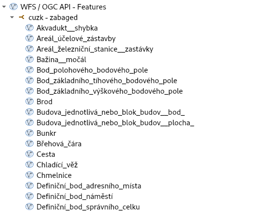
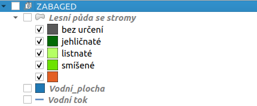
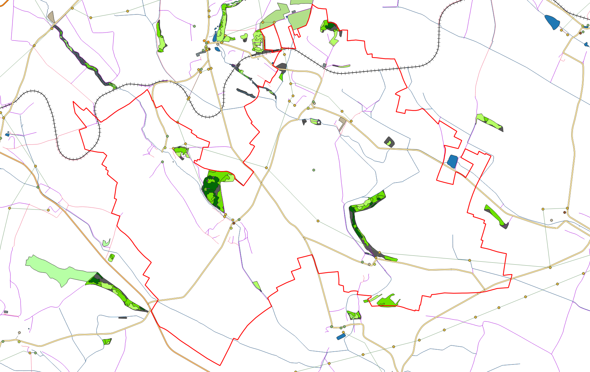
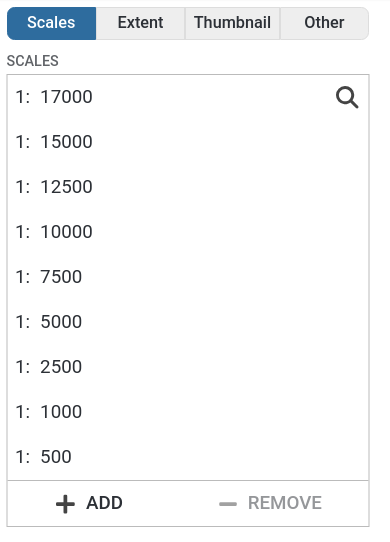
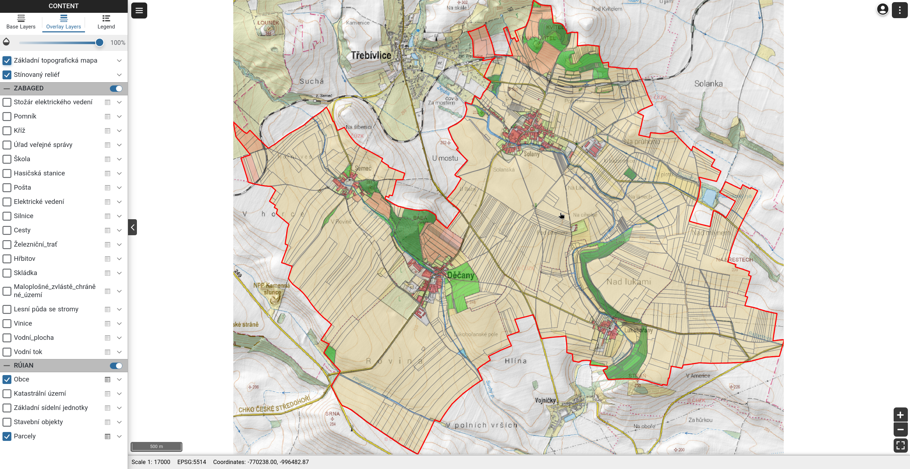

# QGIS – online publikace dat

## Cíl cvičení

Ukázka publikace dat z prostředí QGIS do webového prostoru pomocí publikační plaftormy **Gisquick**.

## Základní pojmy

- [**QGIS**](https://qgis.org) – jeden z nejpoužívanějších open source GIS nástrojů v praxi
- [**Gisquick**](https://gisquick.org/) – jedna z volně dostupných publikačních platforem pro QGIS

## Použité datové podklady

- [RÚIAN](../../data/#ruian)
- [ZABAGED](../../data#zabaged-polohopis)
- [OpenStreetMap](../../data#openstreetmap)

## Náplň cvičení

Pro naši zájmovou obec či menší město zpracujeme projekt v QGIS určený pro online publikaci.

### Příprava projektu

Nahrajte do prostředí QGIS vstupní geografická data. Pro jednotlivé vrstvy nastavte styl vykreslování.

#### RÚIAN

Nainstalujeme zásuvný modul pro práci s datovým zdrojem RÚIAN (viz [předchozí cvíčení](./cviceni9.md)).

Vybereme zájmovou obec či město a stáhneme pomocí zásuvného modulu data RÚIAN.

Výchozí symbologie vrstev je nastavena zásuvným modulem:

!!! note "Poznámka"

    Seznam vrstev je ovlivněn dostupností datových vrstev. U menších obcí může například chybět vrstva ulic a další.
    
    
    
Provedeme v projektu následující změny:

- odstraníme vrstvu "Části obcí" a "Adresní body"
- přípojíme k vrstvě "Parcely" číselníky (viz [předchozí cvíčení](./cviceni9.md)):   
    - [SC_D_POZEMKU](https://www.cuzk.cz/Katastr-nemovitosti/Poskytovani-udaju-z-KN/Ciselniky-ISKN/Ciselniky-k-nemovitosti/Druh-pozemku.aspx)
    - [SC_ZP_VYUZITI_POZ](https://www.cuzk.cz/Katastr-nemovitosti/Poskytovani-udaju-z-KN/Ciselniky-ISKN/Ciselniky-k-nemovitosti/Zpusob-vyuziti-pozemku.aspx)
!!! warning "Důležité"
    Data načítejte namísto prostého přetažení pomocí dialogu `Layer > Data Source Manager`. V tomto případě se korektně nastaví datové typy sloupců. Kódování znaků nastavíme na `windows-1250`.
    
    
    

- podobně přípojíme číselník k vrstvě "Stavební objekty"
    - [SC_ZP_VYUZITI_BUD](https://www.cuzk.cz/Katastr-nemovitosti/Poskytovani-udaju-z-KN/Ciselniky-ISKN/Ciselniky-k-nemovitosti/Zpusob-vyuziti-stavby.aspx)
- na základě připojených číselníků nastavíme symbologii vrstev

!!! tip

    U stavebních objektů můžeme nastavit číslo domovní pomocí funkce `regexp_substr`:
    
    
    
    Popisky nastavme tak, aby se zobrazovaly od meřítka 1:1000 (podobně jako u parcel).
    

    
- u vrstvy "Základní sídelní jednotky" nastavíme popisky podle atributu "Nazev" (pouze do měřítka 1:5000)
- vypneme vrstvu "Katastrální území"
- nastavíme cílové pořadí vrstev

#### WMS zdroje

Do projektu přidáme vybrané [WMS
služby](https://geoportal.cuzk.cz/(S(ktfz4kwhtke20faayarg2abz))/Default.aspx?mode=TextMeta&side=wms.verejne&text=WMS.verejne.uvod&head_tab=sekce-03-gp&menu=311)
poskytované ČÚZK. Pokud existuje ale ekvivaletní [WMTS](
https://geoportal.cuzk.cz/(S(ktfz4kwhtke20faayarg2abz))/Default.aspx?mode=TextMeta&side=wmts.uvod&text=wmts.uvod&head_tab=sekce-03-gp&menu=315) služba, zvolíme raději tuto formu. WMTS by měla pozitivně ovlivnit rychlost načítání vrstvy.

- ZTM5 - `https://ags.cuzk.cz/arcgis1/rest/services/ZTM/MapServer/WMTS`
- Ortofoto - `https://ags.cuzk.cz/arcgis1/rest/services/ORTOFOTO/MapServer/WMTS`
- Stínovaný model reliéfu - `https://ags.cuzk.cz/arcgis2/services/dmr5g/ImageServer/WMSServer`
    - dmr5g:GrayscaleHillshadeZ10
    - dmr5g:SlopeRGBMap
   
!!! tip

    Dojem plastičnosti můžeme dosáhnout kombinací Základní topografické
    mapy při dané míře průhlednosti a vrstvy
    "dmr5g:SlopeRGBMap". Ukázka vizualizace při míře transparetnosti
    75%:
   
    
   
!!! tip "Tip pro pokročilé uživatele"

    U WMTS vrstev by mohlo dojít k zlepšení rychlosti načítaní vrstev pří použití vrstev s měřítkovou sadou Google Maps a odpovídajícího nastavení při publikaci projektu.
    
Služby přidáme pomocí `Layer > Data Source Manager`:

Přidané WMS služby nahrajeme do mapového okna. 

!!! tip

    WMS vrstvy je užitečné seskupit do nové skupniny:
    
    

Dalším z datových zdrojů mohou být WMS služby poskytované agenturou
[CENIA](https://geoportal.gov.cz/arcgis/rest/services/CENIA). Pro náš
účel vyberme III. vojenské mapování: `https://geoportal.gov.cz/arcgis/services/CENIA/cenia_rt_III_vojenske_mapovani/MapServer/WMSServer`:

#### WFS zdroje

Do projektu přidáme vybrané [WFS
služby](https://geoportal.cuzk.cz/(S(ktfz4kwhtke20faayarg2abz))/Default.aspx?mode=TextMeta&side=wfs&text=wfs&head_tab=sekce-03-gp&menu=333)
poskytované ĆÚZK. Vybereme následující vrtsvy z datového zdroje
"Stahovací služba WFS - ZABAGED® - polohopis"
(`https://ags.cuzk.cz/arcgis/services/ZABAGED_POLOHOPIS/MapServer/WFSServer`):

- `zbg:Stožár_elektrického_vedení`
- `zbg:Mohyla__pomník__náhrobek`
- `zbg:Kříž__sloup_kulturního_významu`
- `zbg:Úřad_veřejné_správy_-_definiční_bod`
- `zbg:Škola_-_definiční_bod`
- `zbg:Hasičská_stanice__zbrojnice_-_definiční_bod`
- `zbg:Pošta_-_definiční_bod`
- `zbg:Elektrické_vedení`
- `zbg:Silnice__dálnice`
- `zbg:Vodní_tok`
- `zbg:Cesta`
- `zbg:Železniční_trať`
- `zbg:Hřbitov`
- `zbg:Skládka`
- `zbg:Maloplošné_zvlástě_chráněné_území`
- `zbg:Lesní_půda_se_stromy_kategorizovaná__plocha_`
- `zbg:Vinice`
- `zbg:Vodní_plocha`
- `zbg:Vodní_tok`

U jednotlivých vrstev nastavíme symbologii a vrstvy přejmenujeme:

!!! todo
    
    Doplnit link na stažení stylů.
    
!!! warning "Důležité"

    Vrstvy, u kterých budeme nastavovat kategorizovaný styl doporučujeme stáhnout do lokální databáze ve formátu GeoPackage:

    

    Při stažení dat nastavte korektně zájmové území(!!!):
    
    

!!! todo

    Doplnit skript pro automatizaci stažení dat WFS

Výsledek může pro zájmovou oblast vypadat následovně:

Na závěr nastavme výchozí kompozici. V našem případě jsou parcely
nastaveny na průhlednost 50%. Na pozadí stínovaná základní
topografická mapa:

#### Další zdroje dat

- [Národní katalog otevřených dat](https://data.gov.cz/datov%C3%A9-sady)

!!! todo

    Doplnit další zdroje

!!! todo
    
    Přidat ukázku pro OSM
    
### Publikace projektu

Podklady: [dokumentace Gisquick](https://gisquick.readthedocs.io)

!!! note "Poznámka"

    Pro účel výuky budeme používat vlastní instanci publikačního serveru Gisquick provozované na <http://geo102.fsv.cvut.cz:8083/>.

Po [příhlášení](http://geo102.fsv.cvut.cz:8083/user/) se objeví profil uživatele:

Vytvoříme nový projekt. Objeví se žádost o instalaci zásuvného modulu:

Při instalaci postupuje podle [návodu](https://gisquick.readthedocs.io/en/latest/user-manual/before-publishing.html#qgis-gisquick-plugin).

Poté se pomocí zásuvného modulu přihlásíme do prostředí publikační
platformy Gisquick (`Web > Publish in Gisquick`). 

Do publikačního prostředí platformy Gisquick nás přesměruje tlačítko `Open Browser`:

Po vytvoření projektu se objeví úvodní formulář se seznamem vrstev určených k publikaci:

Nejprve opravíme případné chyby (`Manage Layers Names` > `Generate Names` > `Update QGIS Project`):

Dále povolíme WFS, abychom umožňili uživateli se dotazovat na vektorové vrstvy:

Datové vrstvy nahrajeme na publikační server:

Nastavíme titulek projektu:

Projdeme jednotlivá nastavení projektu:

A provedeme následující změny v nastavení:

- prostorový rozsah nastavíme z vrstvy "Obce":

    
    
- nastavíme vhodnou měřítkovou sadu:

    

A připravený projekt publikujeme (`Publish`). Po publikaci projektu se objeví tlačítko

které nás přesměruje do mapové aplikace:

!!! tip

    Ve výchozím nastavení je projekt nastaven jako soukromý. Toto nastavení lze změnit v `Permissions`:
    
    

!!! task-fg-color "Úkol"

    Změňte nastavení projektu... TODO
