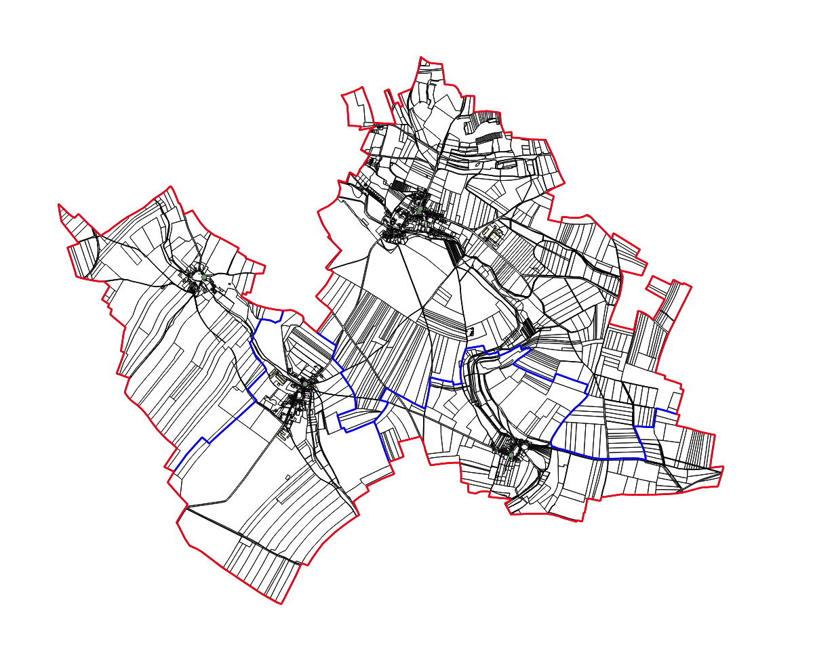
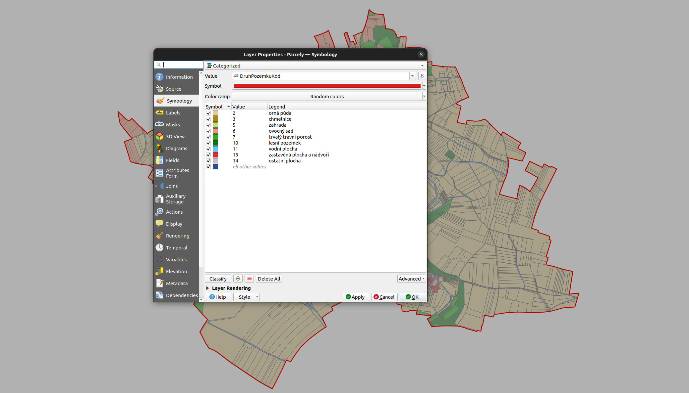

# QGIS – online publikace dat

## Cíl cvičení

Ukázka publikace dat z prostředí QGIS do webového prostoru pomocí publikační plaftormy [Gisquick](https://gisquick.org/).

## Základní pojmy

- [**QGIS**](https://qgis.org) – svobodný a multiplatformní geografický informační systém (GIS)
- [**Gisquick**](https://gisquick.org/) – jedna z volně dostupných publikačních platforem pro QGIS

## Použité datové podklady

- [RÚIAN](../../data/#ruian)
- [Data50](../../data#data50)
- [Veřejná databáze ČSÚ](../../data#verejna-databaze-csu)
- [ZABAGED](../../data#zabaged-polohopis)
- [OpenStreetMap](../../data#openstreetmap)

## Náplň cvičení

Pro naši oblíbenou obec či město zpracujeme projekt v QGIS určený pro online publikaci.

### Příprava projektu

Nahrajte do prostředí QGIS vstupní geografická data. Pro jednotlivé vrstvy nastavte styl vykreslování.

#### RÚIAN

Nainstalujme zásuvný modul pro práci s datovým zdrojem RÚIAN (viz [předchozí cvíčení](./cviceni9.md)).

Vyberme zájmovou obec či město a stáhněme pomocí zásuvného modulu data RÚIAN.

Symbologie vrstev je nastavena zásuvným modulem:

!!! note "Poznámka"

    Seznam vrstev je ovlivněn dostupností datových vrstev. U menších obcí může například chybět vrstva ulic a pod.
    
    
    
Proveďme v projektu následující změny:

- odstraníme vrstvu "Části obcí" a "Adresní body"
- přípojme k vrstvě "Parcely" číselníky (viz [předchozí cvíčení](./cviceni9.md)):   
    - [SC_D_POZEMKU](https://www.cuzk.cz/Katastr-nemovitosti/Poskytovani-udaju-z-KN/Ciselniky-ISKN/Ciselniky-k-nemovitosti/Druh-pozemku.aspx)
    - [SC_ZP_VYUZITI_POZ](https://www.cuzk.cz/Katastr-nemovitosti/Poskytovani-udaju-z-KN/Ciselniky-ISKN/Ciselniky-k-nemovitosti/Zpusob-vyuziti-pozemku.aspx)
!!! warning "Důležité"
    Data načíteje namísto prostého přetažení pomocí dialogu `Layer > Data Source Manager`. V tomto případě se korektně nastaví datové typy sloupců. Kódování znaků nastavíme na `windows-1250`.
    
    
    

- podobně přípojme číselník k vrstvě "Stavební objekty"
    - [SC_ZP_VYUZITI_BUD](https://www.cuzk.cz/Katastr-nemovitosti/Poskytovani-udaju-z-KN/Ciselniky-ISKN/Ciselniky-k-nemovitosti/Zpusob-vyuziti-stavby.aspx)
- na základě připojených číselníků nastavíme symbologii

!!! tip

    U stavebních objektů můžeme nastavit číslo domovní pomocí funkce `regexp_substr`:
    
    
    
    Popisky nastavme tak, aby se zobrazovaly od meřítka 1:1000 (podobně jako u parcel).
    

    
- u vrstvy "Základní sídelní jednotky" nastavíme popisky podle atributu "Nazev" (pouze do měřítka 1:5000)
- vypneme vrstvu "Katastrální území"
- nastavíme cílové pořadí vrstev

#### WMS zdroje

Do projektu přidáme vybrané [WMS
služby](https://geoportal.cuzk.cz/(S(ktfz4kwhtke20faayarg2abz))/Default.aspx?mode=TextMeta&side=wms.verejne&text=WMS.verejne.uvod&head_tab=sekce-03-gp&menu=311)
poskytované ĆÚZK. Pokud existuje ale ekvivaletní [WMTS](
https://geoportal.cuzk.cz/(S(ktfz4kwhtke20faayarg2abz))/Default.aspx?mode=TextMeta&side=wmts.uvod&text=wmts.uvod&head_tab=sekce-03-gp&menu=315) služba, zvolíme raději tuto formu. WMTS by měla pozitivně ovlivnit rychlost načítání vrstvy.

- ZTM5 - `https://ags.cuzk.cz/arcgis1/rest/services/ZTM/MapServer/WMTS`
- Ortofoto - `https://ags.cuzk.cz/arcgis1/rest/services/ORTOFOTO/MapServer/WMTS`
- Stínovaný model reliéfu - `https://ags.cuzk.cz/arcgis2/services/dmr5g/ImageServer/WMSServer`
   - dmr5g:GrayscaleHillshadeZ10
   - dmr5g:SlopeRGBMap
   
!!! tip

   Dojem plastičnosti můžeme dosáhnout kombinací Základní topografické
   mapy při dané míře průhlednosti a vrstvy
   "dmr5g:SlopeRGBMap". Ukázka vizualizace při míře transparetnosti
   75%:
   
   
   
!!! tip "Tip pro pokročilé uživatele"

    U WMTS vrstev by mohlo dojít k zlepšení rychlosti načítaní vrstev pří použití vrstev s měřítkovou sadou Google Maps a odpovídajícího nastavení při publikaci projektu.
    
Služby přidáme pomocí `Layer > Data Source Manager`:

Přidané WMS služby nahrajeme do mapového okna. 

!!! tip

    WMS vrstvy je užitečné seskupit do nové skupniny:
    
    

### WFS zdroje

Do projektu přidáme vybrané [WFS
služby](https://geoportal.cuzk.cz/(S(ktfz4kwhtke20faayarg2abz))/Default.aspx?mode=TextMeta&side=wfs&text=wfs&head_tab=sekce-03-gp&menu=333)
poskytované ĆÚZK. Vybereme následující vrtsvy z datového zdroje
"Stahovací služba WFS - ZABAGED® - polohopis"
(`https://ags.cuzk.cz/arcgis/services/ZABAGED_POLOHOPIS/MapServer/WFSServer`):

- `zbg:Stožár_elektrického_vedení`
- `zbg:Mohyla__pomník__náhrobek`
- `zbg:Kříž__sloup_kulturního_významu`
- `zbg:Úřad_veřejné_správy_-_definiční_bod`
- `zbg:Škola_-_definiční_bod`
- `zbg:Hasičská_stanice__zbrojnice_-_definiční_bod`
- `zbg:Pošta_-_definiční_bod`
- `zbg:Elektrické_vedení`
- `zbg:Silnice__dálnice`
- `zbg:Vodní_tok`
- `zbg:Cesta`
- `zbg:Železniční_trať`
- `zbg:Hřbitov`
- `zbg:Skládka`
- `zbg:Maloplošné_zvlástě_chráněné_území`
- `zbg:Lesní_půda_se_stromy_kategorizovaná__plocha_`
- `zbg:Vinice`
- `zbg:Vodní_plocha`
- `zbg:Vodní_tok`

U jednotlivých vrstev nastavíme symbologii a vrstvy přejmenujeme:

!!! todo
    
    Doplnit link na stažení stylů.
    
!!! warning "Důležité"

    Vrstvy, u kterých budeme nastavovat kategorizovaný styl doporučujeme stáhnout do lokální databáze ve formátu GeoPackage:

    

    Při stažení dat nastavte korektně zájmové území(!!!):
    
    

!!! todo

    Doplnit skript pro automatizaci stažení dat WFS

Výsledek může pro zájmovou oblast vypadat následovně:

Na závěr nastavme výchozí kompozici. V našem případě jsou parcely
nastaveny na průhlednost 50%. Na pozadí stínovaná základní
topografická mapa:

### Publikace projektu

Nejprve si nainstalujeme zásuvný modul Gisquick.

Poté se pomocí zásuvného modulu přihlásíme do prostředí publikační
platformy Gisquick a připravený projekt publikujeme.
<!---
## Zadání domácího úkolu k semestrální práci

Vytvořte si projekt vaší obce, kde žijete a publikute jej v prostředí platformy Gisquick.
--> 
