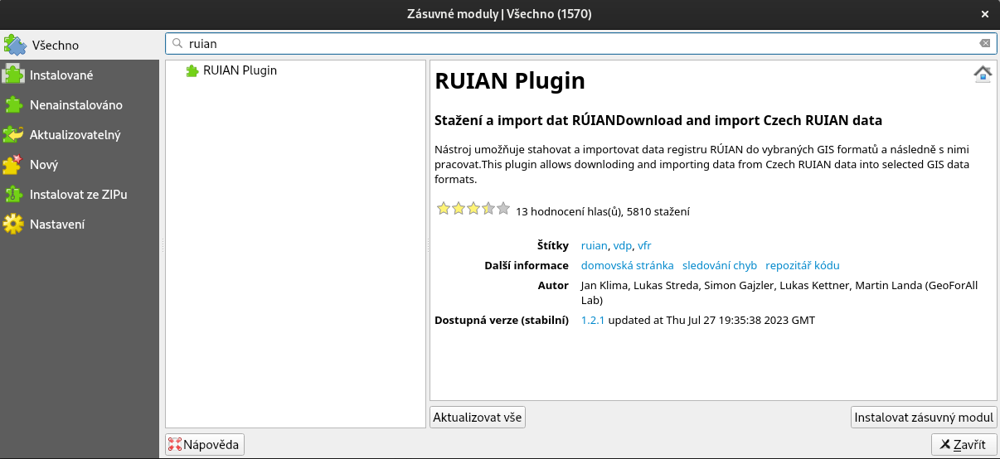
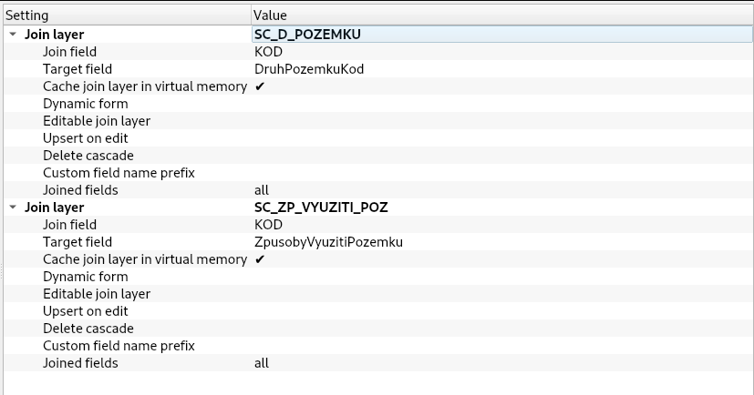
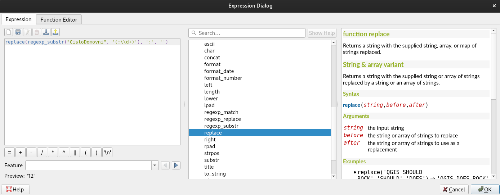

# QGIS – online publikace dat

## Cíl cvičení

Ukázka publikace dat z prostředí QGIS do webového prostoru pomocí publikační plaftormy [Gisquick](https://gisquick.org/).

## Základní pojmy

- [**QGIS**](https://qgis.org) – svobodný a multiplatformní geografický informační systém (GIS)
- [**Gisquick**](https://gisquick.org/) – jedna z volně dostupných publikačních platforem pro QGIS

## Použité datové podklady

- [RÚIAN](../../data/#ruian)
- [Data50](../../data#data50)
- [Veřejná databáze ČSÚ](../../data#verejna-databaze-csu)
- [ZABAGED](../../data#zabaged-polohopis)
- [OpenStreetMap](../../data#openstreetmap)

## Náplň cvičení

Pro naši oblíbenou obec či město zpracujeme projekt v QGIS určený pro online publikaci.

### Příprava projektu

Nahrajte do prostředí QGIS vstupní geografická data. Pro jednotlivé vrstvy nastavte styl vykreslování.

#### RÚIAN

Nainstalujme zásuvný modul pro práci s datovým zdrojem RÚIAN (viz [předchozí cvíčení](./cviceni9.md)).

Vyberme zájmovou obec či město a stáhněme pomocí zásuvného modulu data RÚIAN.

Symbologie vrstev je nastavena zásuvným modulem:

!!! note "Poznámka"

    Seznam vrstev je ovlivněn dostupností datových vrstev. U menších obcí může například chybět vrstva ulic a pod.
    
    
    
Proveďme v projektu následující změny:

- odstraníme vrstvu "Části obcí" a "Adresní body"
- přípojme k vrstvě "Parcely" číselníky (viz [předchozí cvíčení](./cviceni9.md)):   
    - [SC_D_POZEMKU](https://www.cuzk.cz/Katastr-nemovitosti/Poskytovani-udaju-z-KN/Ciselniky-ISKN/Ciselniky-k-nemovitosti/Druh-pozemku.aspx)
    - [SC_ZP_VYUZITI_POZ](https://www.cuzk.cz/Katastr-nemovitosti/Poskytovani-udaju-z-KN/Ciselniky-ISKN/Ciselniky-k-nemovitosti/Zpusob-vyuziti-pozemku.aspx)
!!! warning "Důležité"
    Data načíteje namísto prostého přetažení pomocí dialogu `Layer > Data Source Manager`. V tomto případě se korektně nastaví datové typy sloupců. Kódování znaků nastavíme na `windows-1250`.
    
    
    

- podobně přípojme číselník k vrstvě "Stavební objekty"
    - [SC_ZP_VYUZITI_BUD](https://www.cuzk.cz/Katastr-nemovitosti/Poskytovani-udaju-z-KN/Ciselniky-ISKN/Ciselniky-k-nemovitosti/Zpusob-vyuziti-stavby.aspx)
- na základě připojených číselníků nastavíme symbologii

!!! tip

    U stavebních objektů můžeme nastavit číslo domovní pomocí funkce `regexp_substr`:
    
    
    
    Popisky nastavme tak, aby se zobrazovaly od meřítka 1:1000 (podobně jako u parcel).
    

    
- u vrstvy "Základní sídelní jednotky" nastavíme popisky podle atributu "Nazev" (pouze do měřítka 1:5000)
- vypneme vrstvu "Katastrální území"
- nastavíme cílové pořadí vrstev

### Publikace projektu

Nejprve si nainstalujeme zásuvný modul Gisquick.

Poté se pomocí zásuvného modulu přihlásíme do prostředí publikační
platformy Gisquick a připravený projekt publikujeme.
<!---
## Zadání domácího úkolu k semestrální práci

Vytvořte si projekt vaší obce, kde žijete a publikute jej v prostředí platformy Gisquick.
--> 
