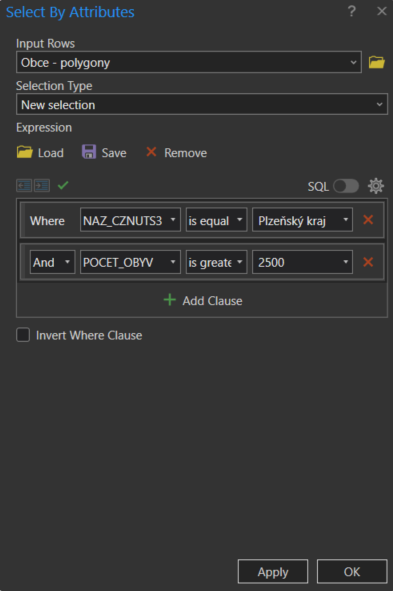
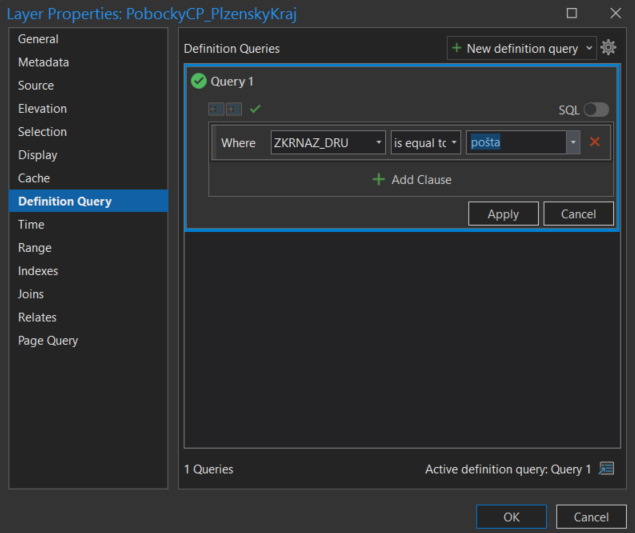
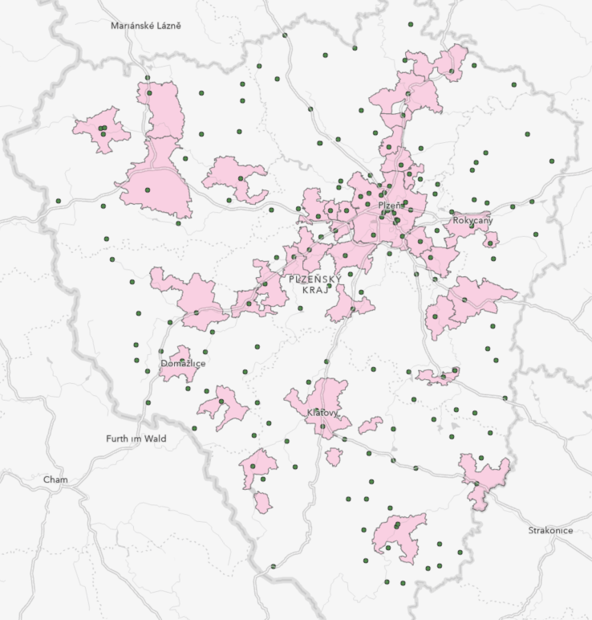
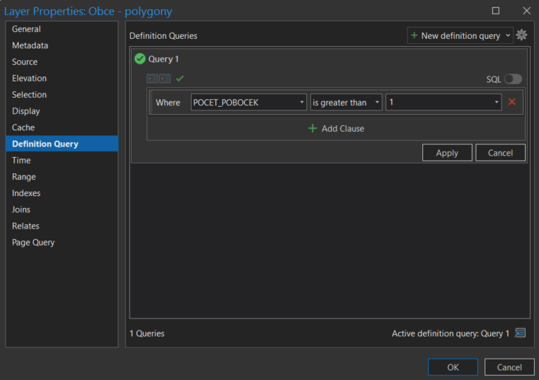
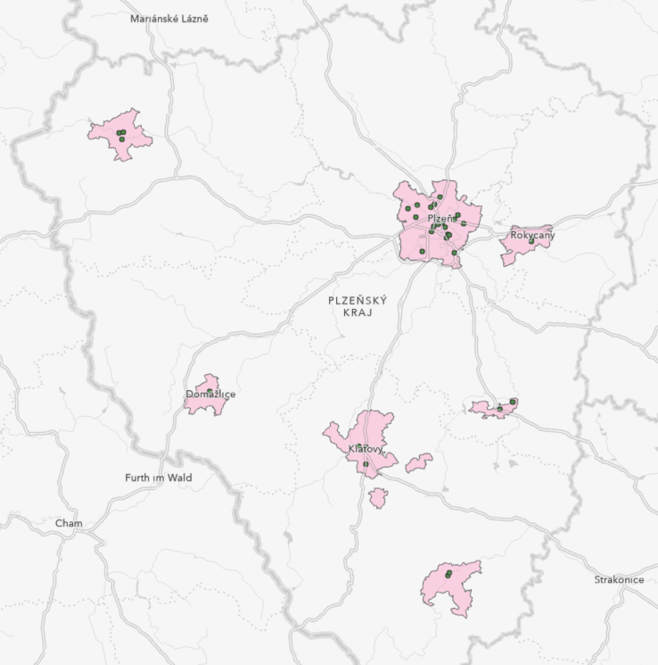

# Prostorové funkce (geoprocessing), spatial join

## Cíl cvičení

Seznámení se se základními geoprocessingovými nástroji v GISu v rámci řešení komplexní úlohy.

## Základní pojmy

- [**buffer**](https://pro.arcgis.com/en/pro-app/latest/tool-reference/analysis/buffer.htm)
- [**clip**](https://pro.arcgis.com/en/pro-app/latest/tool-reference/analysis/clip.htm)
- [**select**](https://pro.arcgis.com/en/pro-app/latest/tool-reference/analysis/select.htm)
- [**intersect**](https://pro.arcgis.com/en/pro-app/latest/tool-reference/analysis/intersect.htm)
- [**spatial join**](https://pro.arcgis.com/en/pro-app/latest/tool-reference/analysis/spatial-join.htm)
- [**erase**](https://pro.arcgis.com/en/pro-app/latest/tool-reference/analysis/erase.htm)
- [**union**](https://pro.arcgis.com/en/pro-app/latest/tool-reference/analysis/union.htm)
- [**remove overlap**](https://pro.arcgis.com/en/pro-app/latest/tool-reference/analysis/remove-overlap-multiple.htm)
- [**symmetrical difference**](https://pro.arcgis.com/en/pro-app/latest/tool-reference/analysis/symmetrical-difference.htm)
- [**count overlapping features**](https://pro.arcgis.com/en/pro-app/latest/tool-reference/analysis/count-overlapping-features.htm)

## Použité datové podklady

- Pobočky České pošty v Plzeňském kraji (bodová vrstva)
- Obce ČR (ArcČR 500, polygonová vrstva)

## Náplň cvičení

Představte si, že pracujete jako GIS analytik pro Českou poštu a vaším úkolem je z důvodu úspor navrhnout řešení snížení počtu poboček. Snahou tohoto kroku je však i minimalizace negativních dopadů na obyvatele, proto bylo rozhodnuto o následujících podmínkách, které musíte ve svém návrhu dodržet:

1. Rušení poboček nebude probíhat v obcích s méně než 2500 obyvateli.
2. V obcích nad 2500 obyvatel neklesne počet poboček pod 1.
3. Vzájemná vzdálenost poboček v jedné obci nebude nižší než 3 km vzdušnou čarou.

Jakou finanční úsporu jste schopni svým návrhem zajistit, pokud by provoz jedné pobočky vycházel ročně na 2,5 milionu CZK? Pro zjednodušení budete úlohu řešit pouze v rámci Plzeňského kraje a ke každé pobočce přistupovat rovnocenně.

## Pracovní postup

**1.** Výběr obcí v Plzeňském kraji s více než 2500 obyvateli (atributový dotaz) a tvorba samostatné vrstvy selektovaných prvků.

<figure markdown>
  
  <figcaption>Atributový dotaz na vrstvu obcí</figcaption>
</figure>

**2.** Výběr typu pobočky pomocí zavedení definition query (výraz: ZKRNAZ_DRU = 'pošta').

<figure markdown>
  
  <figcaption>Definition query pro vrstvu poboček pošty</figcaption>
</figure>

<figure markdown>
  
  <figcaption>Vizualizace stavu nad podkladovou mapou</figcaption>
</figure>

**3.** Spatial join: k výběru obcí připojit pobočky na základě jejich polohy. Zároveň přidat nový atribut POCET_POBOCEK, který bude určen na základě pravidla sumy některého z atributů (např. count(GmIID)).

<figure markdown>
  
  <figcaption>Spatial join</figcaption>
</figure>

**4**. Následně lze učinit výběr obcí s více než 1 pobočkou zavedením definition query (podmínka: POCET_POBOCEK *is greater than* 1).

<figure markdown>
  
  <figcaption>Definition query pro vrstvu obcí</figcaption>
</figure>

**5**. V dalším kroku s využitím nástroje *CLIP* vytvoříme novou vrstvu obsahující všechny pobočky pošty, které se nachází v obcích s více než 1 pobočkou.

<figure markdown>
  
  <figcaption>Vizualizace stavu po provedení spatial join a filtraci obcí s více pobočkami</figcaption>
</figure>

**6**. Obalová zóna 3 km kolem výběru poboček ČP
**7**. Vizuální vytipování poboček ke zrušení
**8**. Ve vrstvě poboček tvorba pomocného atributu RUSENO (short), defaultní hodnota 0
**9**. Manuální výběr poboček ke zrušení, změna hodnoty atributu RUSENO na 1
**10**. Zobrazení rušených poboček, sumarizace (DQ: RUSENO = 1)

## Zadání domácího úkolu k semestrální práci
