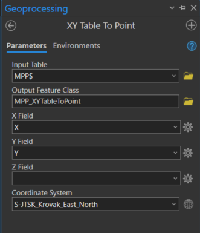
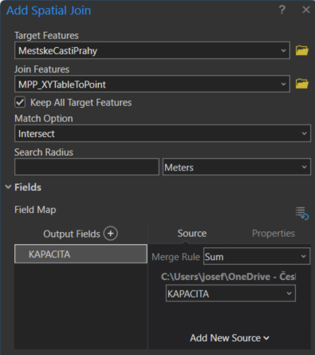

# Práce s externími daty (Excel, CSV), join

## Cíl cvičení

Na rozdíl od předchozích úloh, kdy byla práce zaměřena na práci s poskytnutými prostorovými daty uloženými v geodatabázi či formátu SHP, se následující úloha soustředí na možnosti importu externích tabulárních dat a jejich připojení na prostorová data.

Prostřednictvím společného pole (klíče) lze přiřadit záznamy v jedné tabulce se záznamy v jiné tabulce (vrstvě). K vrstvě parcel můžete například přidružit tabulku informací o vlastnictví parcel, protože sdílejí pole identifikace parcely. Tato přidružení můžete vytvořit několika způsoby, včetně dočasného spojení či vytvoření trvalejších tříd vztahů uvnitř geodatabáze. Spojení může být také založeno na prostorovém umístění, jak bylo demonstrováno ve cvičení 3.

## Základní pojmy

[:material-open-in-new: pro.arcgis.com Join the attributes from a table](https://pro.arcgis.com/en/pro-app/latest/help/data/tables/joins-and-relates.htm#GUID-39C9610A-6A73-4985-ADB8-7354EA9DB8BF){ .md-button .md-button--primary .url-name target="_blank"}
[:material-open-in-new: pro.arcgis.com Join data by location (spatially)](https://pro.arcgis.com/en/pro-app/latest/help/data/tables/joins-and-relates.htm#GUID-7B11EAA4-35E0-4B8D-AFB6-4A435761574B){ .md-button .md-button--primary .url-name target="_blank"}
[:material-open-in-new: pro.arcgis.com Remove join](https://pro.arcgis.com/en/pro-app/latest/help/data/tables/joins-and-relates.htm#ESRI_SECTION1_6507320BCB1E45219A88F1AA0A24F7B9){ .md-button .md-button--primary .url-name target="_blank"}
{: align=center style="display:flex; justify-content:center; align-items:center; column-gap:20px; row-gap:10px; flex-wrap:wrap;"}

## Použité datové podklady

- Polygony [městských částí](../assets/cviceni4/MESTSKECASTI.zip) Prahy
- Tabulka pražských [poboček Městské policie](../assets/cviceni4/objekty_MPP.xlsx) ve fromátu XLSX

## Pracovní postup

**1.** Přidáme polygonovou vrstvu městských částí Prahy do projektu, prohlédneme atributovou tabulku, seznámíme se s daty. V nastavení projektu zvolíme souřadnicový systém S-JTSK (EPSG:5514).

**2.** Dále otevřeme tabulku poboček městské policie v Praze v MS Excel. Jelikož tabulka obsahuje také sloupce se souřadnicemi v S-JTSK, bude možné ji připojit do projektu a vykreslit. Zavřeme Excel a pomocí *Add Data* a *XY Point Data* vyhledáme tabulku (je nutné vybrat přímo list souboru XLSX) viz obrázek. Souřadnice X, Y asociujeme s příslušnými poly tabulky (propíší se pravděpodobně automaticky) a zvolíme správný souřadnicový systém (EPSG:5514).

<figure markdown>
  
  <figcaption>Přidání bodových dat do projektu</figcaption>
</figure>

<figure markdown>
  
  <figcaption>Dialogové okno pro nahrání bodových dat se souřadnicemi z tabulky</figcaption>
</figure>

**3.** V této fázi máme dvě vrstvy: bodovou (pobočky MPP) a polygonovou (MČ Prahy). Pro zopakování bude nejprve vhodné vyzkoušet prostorové připojení prvků. Např. bychom mohli zjistit, kolik poboček MPP se nachází v každé MČ Prahy a dále, jaká je jejich celková kapacita, jinými slovy, kolik příslušníků Městské policie spadá do každé městské části. Ačkoliv jsou dotazy dva, je možné je zpracovat najednou. Pravým kliknutím na vrstvu MČ vyvoláme přes *Join and Relates* a *Add Spatial Join* dialogové okno. Defaultní nastavení je nutné upravit. Za prvé, v sekci *Output Fields* lze definovat pravidla pro připojení jednotlivých polí z tabulky. Vzhledem k tomu, že úkolem je zjistit celkovou kapacitu, lze všechna pole kromě kapacity smazat a pro pole kapacita vybrat z nabídky pravidel (*Merge Rule*) sumu (viz obrázek). Za druhé je potřeba zaškrtnout parametr *Keep All Target Features*, aby byly zachovány všechny původní prvky, včetně takových, ke kterým nebude prostorově připojen žádný prvek.

<figure markdown>
  
  <figcaption>Atributové pravidlo u prostorového připojení dat</figcaption>
</figure>

**4.** Tímto způsobem se obohatí původní vrstva MČ o nová data dle definovaných pravidel. Po otevření atributové tabulky jsou nově připojené záznamy přidruženy z pravé strany. Zajímavý atribut, který se vytváří automaticky pro každý *Spatial Join*, představuje *Join_Count*. Ten obsahuje počet prvků, které byly k danému (původnímu) prvku připojeny (zde se jedná o počet poboček MPP v dané MČ). Tímto způsobem je např. možné zjistit:

>>**a.** která MČ disponuje nejvíce pobočkami MPP

>>**b.** ve kterých MČ není žádná pobočka MPP

>>**c.** ve které MČ pracuje nejvíce pracovníků městské policie

**5.** TBA TBA TBA
Připojit data z ČSÚ, provést export do gdb, odstranit joiny... Zjistit, kolik policistů připadá na 100 obyvatel MČ.