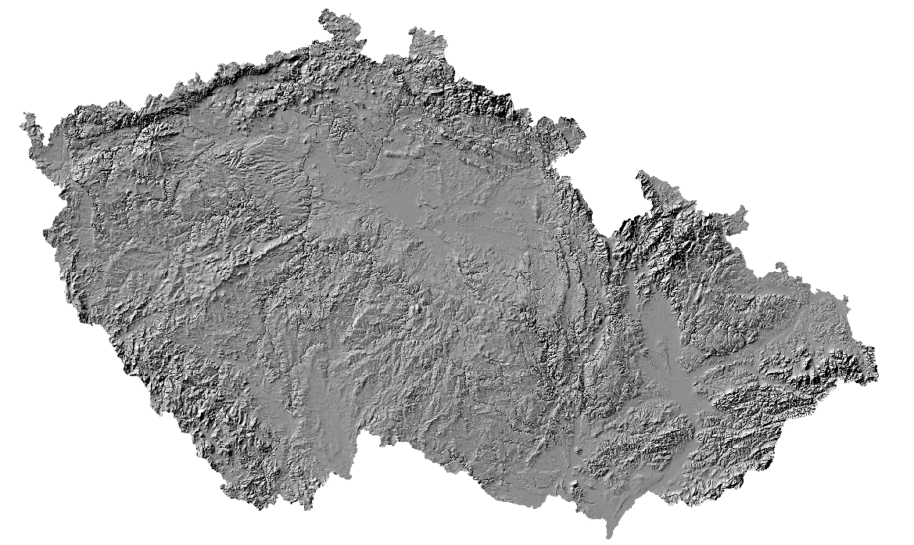
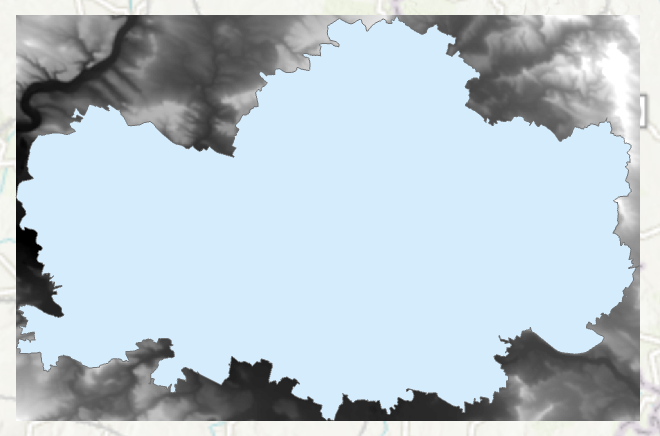

# Rastrová data, georeference - zkušební cvičení

## Cíl cvičení

Seznámení se s rastrovými daty v GISu a ukázka využití těchto dat. Souřadnicové připojení rastrových dat. Práce s mosaic dataset.

## Základní pojmy

- **rastr** - datová struktura založená na buňkách uspořádaných do řádek a sloupců, kde hodnota každé buňky reprezentuje hodnotu jevu
- [**rastrová data**](https://pro.arcgis.com/en/pro-app/latest/help/data/imagery/introduction-to-raster-data.htm) - prostorová data vyjádřená formou matice buněk nebo pixelů; spojitá data (nejčastěji digitální modely terénu, digitalizované mapy)
- [**pixel (buňka)**](https://pro.arcgis.com/en/pro-app/latest/help/data/imagery/pixel-size-of-image-and-raster-data-pro-.htm) - základní geometrický prvek zpravidla čtvercového tvaru; jeho množina vytváří rastrový digitální obraz; 1 buňka = 1 hodnota
- [**prostorové rozlišení rastru**](https://pro.arcgis.com/en/pro-app/latest/tool-reference/environment-settings/cell-size.htm) - velikost 1 buňky (pixelu) rastru (cell size)
- [**resample**](https://pro.arcgis.com/en/pro-app/latest/tool-reference/data-management/resample.htm) - změna prostorového rozlišení rastru
- **digitální model reliéfu (DMR)** - digitální reprezentace zemského povrchu; rastr; neobsahuje lidské stavby
- **digitální model terénu (DMT)** - digitální reprezentace zemského povrchu; rastr; obsahuje lidské stavby
- [**transformace**](https://pro.arcgis.com/en/pro-app/latest/help/mapping/properties/geographic-coordinate-system-transformation.htm) - obecný pojem pro výpočet, jehož cílem je převod souřadnic bodů z jednoho souřadnicového systému do druhého
- [**georeference**](https://pro.arcgis.com/en/pro-app/3.0/help/data/imagery/overview-of-georeferencing.htm) - proces určení vztahu mezi polohou dat v přístrojovém souřadnicovém systému a geografickou
- [**pyramidování rastru**](https://pro.arcgis.com/en/pro-app/latest/help/data/imagery/raster-pyramids.htm) - ukládání dat do menšího rozlišení pro rychlejší práci; pyramidy (náhledy) jsou uloženy v souborech .ovr

## Použité datové podklady

- [ArcČR 500](../data/#arccr-500)
- [Císařské otisky stabilního katastru](../data/#cisarske-otisky-stabilniho-katastru)
- [DMR 5G](../data/#dmr-5g)
- [RÚIAN](../data/#ruian)

## Náplň cvičení

### Ukázka nejčastějších rastrových typů dat
1. **Digitální model terénu/reliéfu**

<figure markdown>

    <figcaption>Digitální model reliéfu 4. generace (zdroj: ArcČR 500 v3.3)</figcaption>
</figure>

2. **Stínovaný reliéf**

<figure markdown>

    <figcaption>Stínovaný reliéf (zdroj: ArcČR 500 v3.3)</figcaption>
</figure>

3. **Naskenovaný mapový list**
<figure markdown>

    <figcaption>Císařské otisky stabilního katastru (zdroj: ČÚZK)</figcaption>
</figure>

### Práce s digitálním modelem reliéfu

**Zdroj dat** - DMR 4G (ArcČR)  
DMR 4G představuje hodnoty nadmořské výšky pro Českou republiku s rozlišením 5x5 metrů. Verze z ArcČR je však převzroskovaná a má velikost 1 pixelu 50x50 metrů.

Cílem této úlohy je seznámení se se základními pracemi s rastrovými daty.

**1.** Načtení DMR 4G z databáze ArcČR (vrstva *DigitalniModelReliefu*)
**2.** Zjištění prostorového rozlišení rastru (pravý klik na daný rastr v záložce Contents -> Properties -> Source -> Raster Information -> Cell Size X/Y)
**3.** Výběr okresu k ořezu rastru (*OkresyPolygony*)
**4.** Export vybraného okresu do samostatné vrstvy - pravý klik na vybranou vrstvu -> Data -> Export Features

<figure markdown>
  { width="800" }
  <figcaption>Export features</figcaption>
</figure>

**5.** Ořez DMR dle hranic vybraného okresu

**6.** [Clip Raster](https://pro.arcgis.com/en/pro-app/latest/tool-reference/data-management/clip.htm) - vytvoří ořez dle nejmenšího ohraničujícího obdélníka

<figure markdown>

    <figcaption>Clip raster</figcaption>
</figure>

**7.** [Extract by Mask](https://pro.arcgis.com/en/pro-app/latest/tool-reference/spatial-analyst/extract-by-mask.htm) - ořízne rastr přesně dle polygonu (s přesností na pixely)

<figure markdown>

    <figcaption>Extract by mask</figcaption>
</figure>

### Ukázka změny symbologie rastru
Rastrovým vrstvám se (stejně jako vektorovým) může měnit vzhled v záložce [Symbology](https://pro.arcgis.com/en/pro-app/latest/help/data/imagery/symbology-pane.htm). Nabídka se zobrazí pravým klinutím myši na danou vrstvu -> Symbology.

<figure markdown>
  { width="800" }
  <figcaption>Nastavení symbologie DMR</figcaption>
</figure>

### Georeferencování rastru

1. Načtení rastru do mapového okna
2. Zapnutí funkce Georeference: záložka Imagery -> Georeference
3. Postup dle následujícího videa:

<iframe width="560" height="315" src="https://www.youtube.com/embed/H7m7rX9fswE" title="YouTube video player" frameborder="0" allow="accelerometer; autoplay; clipboard-write; encrypted-media; gyroscope; picture-in-picture; web-share" allowfullscreen></iframe>

## Zadání domácího úkolu k semestrální práci

1. Vytvořte ořez DMR 5G pro území zadané obce.
2. Vytvořte bezešvou mozaiku georeferencovaných rastrů císařských otisků stabilního katastru pro území zadané obce.
