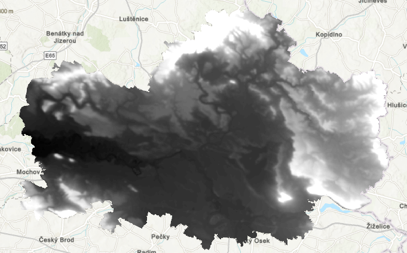
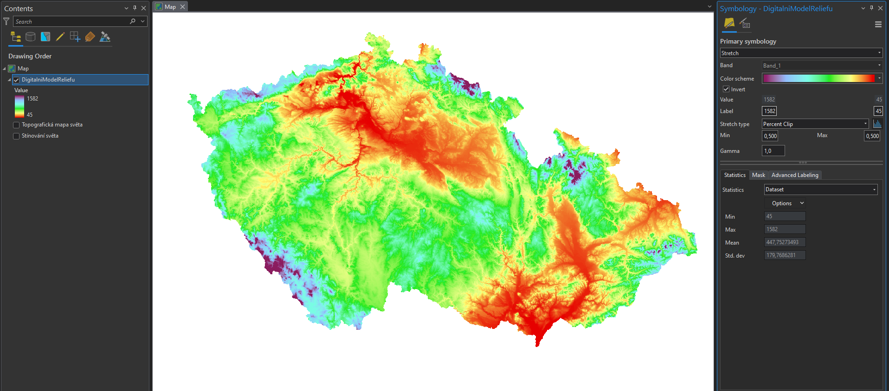
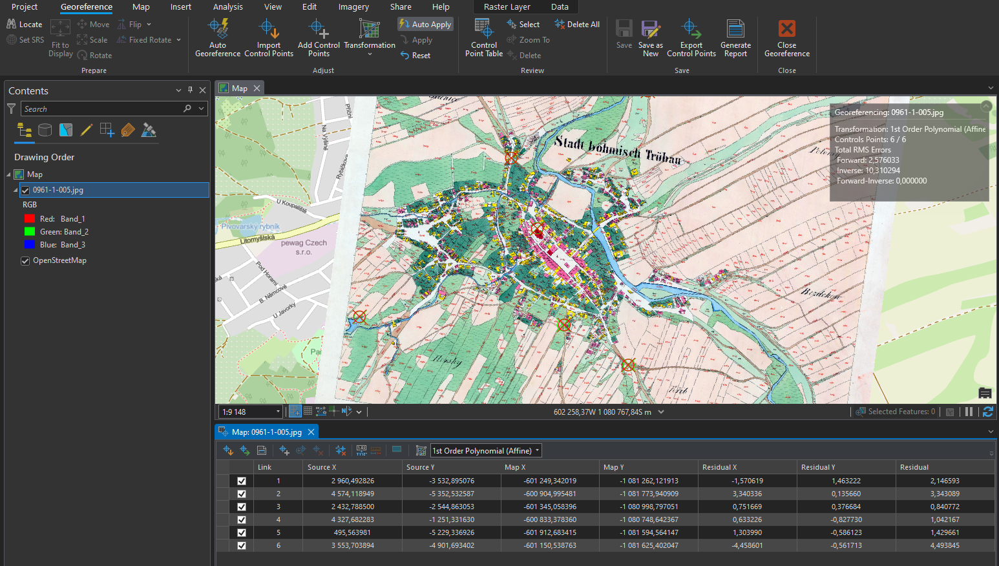
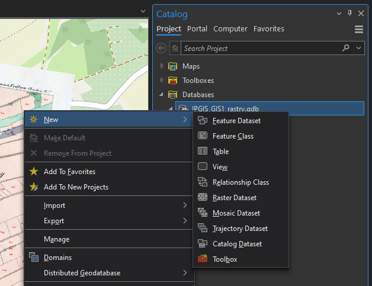
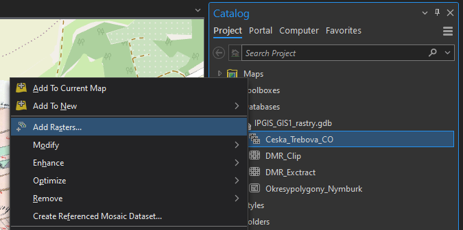
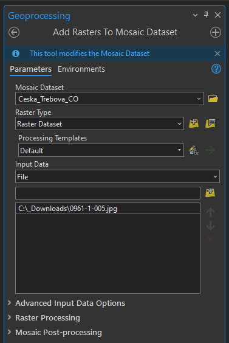
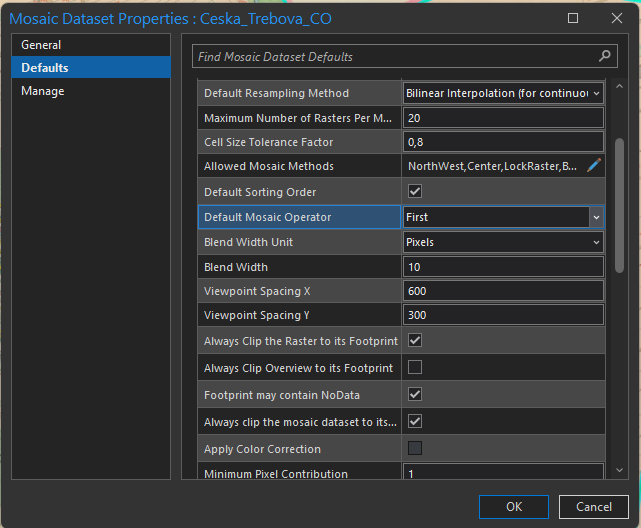
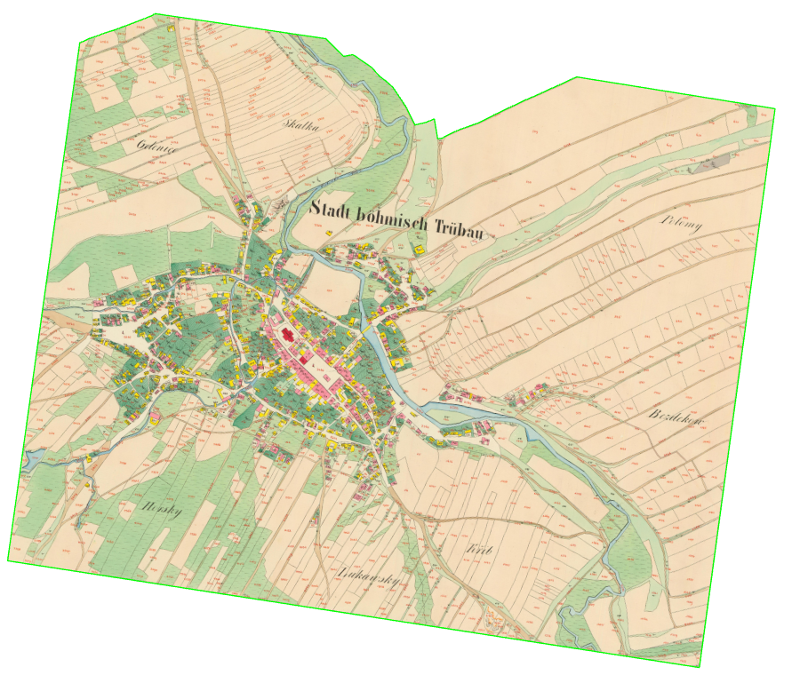

# Rastrová data, georeferencování

## Cíl cvičení

Seznámení se s rastrovými daty v GIS a ukázka využití těchto dat. Souřadnicové připojení rastrových dat. Práce s Mosaic Dataset.

## Základní pojmy

- **rastr** – datová struktura založená na buňkách uspořádaných do řádek a sloupců, kde hodnota každé buňky reprezentuje hodnotu jevu
- [**rastrová data**](https://pro.arcgis.com/en/pro-app/latest/help/data/imagery/introduction-to-raster-data.htm) – prostorová data vyjádřená formou matice buněk nebo pixelů; spojitá data (nejčastěji digitální modely terénu, digitalizované mapy)
- [**pixel (buňka)**](https://pro.arcgis.com/en/pro-app/latest/help/data/imagery/pixel-size-of-image-and-raster-data-pro-.htm) – základní geometrický prvek zpravidla čtvercového tvaru; jeho množina vytváří rastrový digitální obraz; 1 buňka = 1 hodnota
- [**prostorové rozlišení rastru**](https://pro.arcgis.com/en/pro-app/latest/tool-reference/environment-settings/cell-size.htm) – velikost 1 buňky (pixelu) rastru (cell size)
- [**resample**](https://pro.arcgis.com/en/pro-app/latest/tool-reference/data-management/resample.htm) – změna prostorového rozlišení rastru
- **digitální model reliéfu (DMR)** – digitální reprezentace zemského povrchu; rastr; neobsahuje lidské stavby
- **digitální model terénu (DMT)** – digitální reprezentace zemského povrchu; rastr; obsahuje lidské stavby
- [**transformace**](https://pro.arcgis.com/en/pro-app/latest/help/mapping/properties/geographic-coordinate-system-transformation.htm) – obecný pojem pro výpočet, jehož cílem je převod souřadnic bodů z jednoho souřadnicového systému do druhého
- [**georeference**](https://pro.arcgis.com/en/pro-app/3.0/help/data/imagery/overview-of-georeferencing.htm) – souřadnicové určení snímku
- [**pyramidování rastru**](https://pro.arcgis.com/en/pro-app/latest/help/data/imagery/raster-pyramids.htm) – ukládání dat do menšího rozlišení pro rychlejší práci; pyramidy (náhledy) jsou uloženy v souborech .ovr
- [**mosaic dataset**](https://pro.arcgis.com/en/pro-app/latest/help/data/imagery/mosaic-datasets.htm) – mozaika; datová sada sjednocující jeden či více rastrů; umožňuje ořez mimorámových údajů

## Použité datové podklady

- [ArcČR 500](../../data/#arccr-500)
- [Císařské otisky stabilního katastru](../../data/#cisarske-otisky-stabilniho-katastru)
- [DMR 4G](../../data/#dmr-5g)

## Pozn

- video georeferencování
- studenti budou používat data stabilního katastru Zhůří. Většinu mapových listů dostanou georeferencoanou a jeden budou muset oklikat sami.
- rozmyslet zadání dú

## Náplň cvičení

### Ukázka nejčastějších rastrových typů dat

**1. Digitální model terénu/reliéfu**

<figure markdown>
{ width="800" }
    <figcaption>Digitální model reliéfu 4. generace (zdroj: ArcČR 500 v3.3)</figcaption>
</figure>

**2. Stínovaný reliéf**

<figure markdown>
{ width="800" }
    <figcaption>Stínovaný reliéf (zdroj: ArcČR 500 v3.3)</figcaption>
</figure>

**3. Naskenovaný mapový list**

<figure markdown>
{ width="800" }
    <figcaption>Císařské otisky stabilního katastru (zdroj: ČÚZK)</figcaption>
</figure>

### Práce s digitálním modelem reliéfu

**Zdroj dat** – DMR 4G ([ArcČR 500](../../data/#arccr-500))  
DMR 4G představuje hodnoty nadmořské výšky pro Českou republiku s rozlišením 5x5 metrů. Verze z ArcČR je však převzorkovaná a má velikost 1 pixelu 50x50 metrů.

**1.** Načteme DMR 4G z databáze ArcČR (vrstva _DigitalniModelReliefu_).

**2.** Zjištění prostorového rozlišení rastru (pravý klik na daný rastr v záložce _Contents_ -> _Properties_ -> _Source_ -> _Raster Information_ -> _Cell Size X/Y_).

**3.** Vybereme okres pro ořez rastru (_OkresyPolygony_).

**4.** Export vybraného okresu do samostatné vrstvy provedeme přes pravý klik myši na vybranou vrstvu -> _Data_ -> _Export Features_.

<figure markdown>
  { width="800" }
  <figcaption>Export features</figcaption>
</figure>

**5.** Ořez rastru lze provést několika způsoby. Nejjednodušší možností je funkce [Clip Raster](https://pro.arcgis.com/en/pro-app/latest/tool-reference/data-management/clip.htm), která vytvoří ořez dle nejmenšího ohraničujícího obdélníku.

<figure markdown>

    <figcaption>Clip raster</figcaption>
</figure>

**6.** Další možností je funkce [Extract by Mask](https://pro.arcgis.com/en/pro-app/latest/tool-reference/spatial-analyst/extract-by-mask.htm), jež ořízne rastr přesně dle polygonu (s přesností na pixely).

<figure markdown>

    <figcaption>Extract by mask</figcaption>
</figure>

### Ukázka změny symbologie rastru

Rastrovým vrstvám lze (stejně jako vektorovým) měnit vzhled v záložce [_Symbology_](https://pro.arcgis.com/en/pro-app/latest/help/data/imagery/symbology-pane.htm). Nabídka se zobrazí pravým klinutím myši na danou vrstvu -> _Symbology_.

<figure markdown>
  
  <figcaption>Nastavení symbologie DMR</figcaption>
</figure>

### Georeferencování rastru

**Zdroj dat** – ČÚZK

**Návod ke georeferencování:**

**1.** Načtení rastru do mapového okna z adresáře v záložce _Catalog_. Rastr se umístí po počátku aktuálního souřadnicového systému. Přiblížit se na něj lze po kliknutí pravým tlačítkem na jeho název v záložce _Contents_ -> _Zoom To Layer_.

**2.** Následně zapneme funkci Georeference: záložka _Imagery_ -> _Georeference_.

<figure markdown>
  
  <figcaption>Georeferencování rastru</figcaption>
</figure>

**3.** V nástroji _Georeference_ je potřeba nastavit identické body, na základě kterých se mapový list transformuje do souřadnicového systému mapy.

**4.** Mapu přiblížíme na výřez obrazovky tlačítkem _Fit to Display_.

**5.** Pokud již známe identické body, je možné je importovat pomocí _Import Control Points_. Jestliže tyto body nemáme, musíme je ručně vytvořit tlačítkem _Add Control Points_.

**6.** Při vkládání bodů se nejprve určí bod ze vstupního mapového listu (_source_) a následně jeho ekvivalent v mapě (_target_). Důležité je vybírat identické body rovnoměrně po celé ploše mapového listu a ideálně vybírat taková místa, která jsou na obou vrstvách (mapový list a podkladová mapa) totožná. Nejčastěji se jedná o rohy významných budov (kostely), křížení silnic či boží muka. Identické body a jejich přesnost určujeme dle měřítka georeferencované mapy.

**7.** V některých případech je velmi obtížné najít identické body, zejména u starších archiválií. Na příkladu, který je uveden v tomto návodu, je patrná obrovská změna využití ploch v České Třebové.

<figure markdown>
  
  <figcaption>Georeferencovaný mapový list</figcaption>
</figure>

**8.** Během procesu georeference je nutné sledovat přesnost výsledného souřadnicoého umístění dat. Tu na jdeme v tabulce _Control Point Table_ v nástroji _Georeference_. V této tabulce se nachází přehled všech identických bodů včetně jejich souřadnicových přesností. Můžeme zde také body mazat nebo je vyřadit z výpočtu transformace. Body jsou zároveň znázorněny v mapovém okně.

**9.** Při georeferencování v *ArcGIS Pro* lze použít několik druhů souřadnicových transformací. Druh transforamce volíme na základě vstupních dat. Pro ukázku s císařskými otisky stabilního katastru, je ideální afinní transformace, která se nabízí jako výchozí.

**10.** Pokud jsme spokojeni s georeferencováním, uložíme jej tlačítkem _Save_. Jestliže by bylo potřeba, je možné nastavení souřadnicového umístění změnit. Nástroj Georeference můžeme nyní zavřít _Close_.

**Video-návod ke georeferencování map:**

<iframe width="560" height="315" src="https://www.youtube.com/embed/H7m7rX9fswE" title="YouTube video player" frameborder="0" allow="accelerometer; autoplay; clipboard-write; encrypted-media; gyroscope; picture-in-picture; web-share" allowfullscreen></iframe>

### Vytvoření mozaiky

Pro vytvoření ucelené mapové vrstvy a následné zpracování rastrů, se využívá _Mosaic Dataset_. Do mozaiky přesuneme požadované rastry. Mozaika vygeneruje vektorové vrstvy _Footprint_ a *Boundary*. _Footprint_ slouží k ořezu mimorámových údajů každého rastru a *Boundary* je ohraničení celé mozaiky.

**1.** _Mosaic Dataset_ vytvoříme kliknutím pravého tlačítka myši na geodatabázi v záložce _Catalog_ -> _New_ -> _Mosaic Dataset_.

<figure markdown>
  
  <figcaption>Vytvoření Mosaic Dataset</figcaption>
</figure>

**2.** V záložce _Geoprocessing_ vyplníme název mozaiky _Mosaic Dataset Name_ a příslušný souřadnicový systém _Coordinate System_ (ten je vhodné zvolit stejný jako v mapě – _Current Map_). Ostaní parametry ponecháme ve výchozím nastavení.

<figure markdown>
  
  <figcaption>Vytvoření Mosaic Dataset</figcaption>
</figure>

**3.** Vytvořená mozaika se rovnou přidá do mapy, tudíž její vrstvu vidíme v záložce _Contents_. Mozaika je stále prázdná, musíme do ní tedy přidat georeferencované rastry.

**4.** Pravým kliknutím na mozaiku v záložce _Catalog_ -> _Add Rasters_ otevřeme funkci importu rastrů do mozaiky. Funkci lze najít i v záložce _Geoprocessing_.

<figure markdown>
  
  <figcaption>Přidání rastrů do mozaiky</figcaption>
</figure>

**5.** Ve funkci _Add Rasters To Mosaic Dataset_ zvolíme výstupní mozaiku a ikonou s plusem v části _Input Data_ nahrajeme soubory. Pokud máme více georeferencovaných rastrů, je vhodné je uchovávat v jedné složce (včetně souborů určujících parametry transformace), kterou pak do mozaiky nahrajeme celou. V jiném případě můžeme nahrát přímo soubor tak, že změníme v *Input Data* _Folder_ na _File_. Při výběru souboru v průzkumníku pak změníme CSV na všechny typy souborů a najdeme potřebné soubory. Ostatní parametry nyní ponecháme ve výchozím stavu.

<figure markdown>
  
  <figcaption>Přidání rastrů do mozaiky</figcaption>
</figure>

### Editování mozaiky

**1.** Pro vytvoření bezešvé mozaiky je potřeba nastavit hranice vrstvy _Footprint_ dle požadovaného ořezu dat.

**2.** V záložce _Edit_ zvolíme _Edit Vertices_ a pro přidání, odebrání či posunutí lomových bodů využíváme nově otevřenou nabídku ikon v dolní části obrazovky. Pro uložení editace musíme stisknout ikonu _Finish_ dole ve zmíněné nabídce ikon a následovně _Save_ nahoře vlevo v záložce _Edit_. Vzhledem k tomu, že císařské otisky stabilního katastru jsou mapy bez pravidelného jednotného kladu mapových listů, je nutné editaci _Footprintu_ oklikat ručně. Automatický ořez _Footprintu_ lze použít například na data Státní mapy 1 : 5 000 – odvozené. Tato metoda je probírána v následujícím cvičení.

<figure markdown>
  
  <figcaption>Editace Footprintu</figcaption>
</figure>

**3.** Při editaci sousedících mapových listů je nutné lomové body přichytit na sebe se zapnutou funkcí _Snapping_ v záložce _Edit_. Jinak by nebyla mozaika bezešvá a obsahovala by díry.

**4.** Ořez rastru dle _Footprintu_ je nutné nastavit v parametrech mozaiky: v *Catalogu* -> kliknutím pravého tlačítka na mozaiku -> _Properties_ -> _Defaults_ -> zaškrtnout _Always Clip the Raster to its Footprint_. Pokud se nebudou další případné změny _Footprintu_ projevovat v mapě, je potřeba ve stejné nabídce vždy změnit _Default Mosaic Operator_ z *First* na _Last_ a naopak.

<figure markdown>
  
  <figcaption>Parametry mozaiky</figcaption>
</figure>

**5.** Po potvrzení změny parametrů v parametrech mozaiky by se měly oříznout vybrané mimorámové údaje z mapového listu.

<figure markdown>
  { width="800" }
  <figcaption>Hotová mozaika georeferencovaného mapového listu</figcaption>
</figure>

## Zadání domácího úkolu k semestrální práci

1. Vytvořte ořez DMR 5G pro území zadané obce.

2. Vytvořte bezešvou mozaiku georeferencovaných rastrů císařských otisků stabilního katastru pro území zadané obce.
