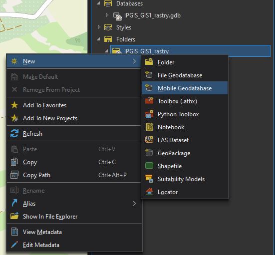

# Vektorizace, tvorba geodatabáze, kontrola topologie

## Cíl cvičení

Navázání na minulé cvičení. Ukázka automatického ořezu footprintu. Tvorba vlastní geodatabáze, vektorizace a práce s atributy. Ukázka kontroly topologie vektorových dat.

## Základní pojmy

- [**geodatabáze**](https://pro.arcgis.com/en/pro-app/3.0/help/data/geodatabases/overview/what-is-a-geodatabase-.htm) – prostředí pro správu bází geografických dat

- [**dataset**](https://pro.arcgis.com/en/pro-app/latest/help/data/feature-datasets/feature-datasets-in-arcgis-pro.htm) – Soubor shrnující pod sebe vybrané třídy prvků se stejným souřadnicovým systémem.

- **vektorizace** – přepracování mapy v analogové formě, popř. digitální mapy v rastrové formě do vektorové formy

- [**topologie**](https://pro.arcgis.com/en/pro-app/latest/help/data/topologies/topology-in-arcgis.htm) – definování struktury prvků geosystému na základě jejich vztahů konektivity (vzájemného spojení) a kontinuity (vzájemné polohy)

## Použité datové podklady

- [Císařské otisky stabilního katastru](../../data/#cisarske-otisky-stabilniho-katastru)
- [Státní mapa 1 : 5 000 – odvozená](../../data/#statni-mapa-1-:-5-500-0-–-odvozena)
- klad SMO5

## Pozn

- nahrát data smo5 rastry + smo5 klad

## Náplň cvičení

### Založení nové geodatabáze

**1.** Geodatabázi vytvoříme kliknutím pravým tlačítkem myši na složku našeho projektu v záložce *Catalog* -> *New* -> *File Geodatabase*.

???+ note "&nbsp;Poznámka ke geodatabázi:"
      Takto vytvořenou geodatabázi můžeme otevřít v jakémkoliv jiném ArcGIS Pro Projektu. Geodatabáze je vhodná pro sdílení GIS dat – lze jí otevřít také v jiných GIS softwarech (např. QGIS)

<figure markdown>

    <figcaption>Tvorba nové geodatabáze</figcaption>
</figure>

### Importu předem georeferencovaného rastru

**1.** Do mapy si načteme částečně georeferencované listy Státní mapy 1 : 5 000 – odvozené (SMO5). Bude nutné negeoreferencované listy souřadnicově umístit.

**2.** Oproti císařským otiskům stabilního katastru, které se georeferencují na identické body v mapě, lze SMO5 georeferencovat na rohové body mapových listů, které mají dané souřadnice v sysému S–JTSK (EPSG:5514). Pro georeferencování použijeme síť kladu mapových listů SMO5 (síť o rozměrech 2,5x2 km).

**3.** Dle postupu z minulého cvičení si georeferencujeme zbývající souřadnicově nepřipojené mapové listy. Následně vytvoříme v nové geodatabázi mozaiku, do které georeferencované rastry importujeme.

### Automatický ořez footprintu

Ve stavu, kdy máme přidané georeferencované rastry do mozaiky, je potřeba oříznout jejich footprint tak, aby se vytvořila bezešvá mapová vrstva. Footprint lze upravit ručně (viz minulé cvičení) nebo automaticky načtením kladu mapových listů.

**1.** V mapovém okně otevřeme mozaiku a klad mapových listů. Kladu mapových listů změníme symbologii tak, abychom viděli pouze hrany listů. 

<figure markdown>

    <figcaption>Mozaika a klad mapových listů v mapovém okně</figcaption>
</figure>

**2.** Před automatickým ořezem footprintů je nutné zkontrolovat pojmenování listů, které musí být jak v mozaice, tak v kladu listů stejné. Případně je potřebný jiný jednoznačný atribut, na základě kterého se obě vrstvy propojí.

<figure markdown>
{ width="800" }
    <figcaption>Ukázka atributových tabulek předpřipravených vrstev</figcaption>
</figure>

**3.** Automatický ožez footprintu probíhá následovně: pravým kliknutím myši na danou mozaiku -> *Modify* -> *Import Footprints or Boundary*. 

**4.** Ve funkci *Import Mosaic Dataset Geometry* nastavíme parametry dle obrázku níže.

- *Target Feature Class* – vrstva, jejíž geometrii chceme upravit. 

- *Target Join Field* – sloupec s jednoznačným indetifikátorem výstupní vrstvy.

- *Input Feature Class* – ořezová vrstva.

- *Input Join Field* – sloupec s jednoznačným indetifikátorem ořezové vrstvy.

<figure markdown>

    <figcaption>Nastavení funkce Import Mosaic Dataset Geometry</figcaption>
</figure>

**5.** Výsledek funkce *Import Mosaic Dataset Geometry* je vidět níže.

<figure markdown>

    <figcaption>Výsledek automatického ořezu footprintu</figcaption>
</figure>

### Vytvoření nového datasetu v geodatabázi

**1.** Pro vytvoření souhrného datasetu, ve kterém budeme následně uchovávat některé datové vrstvy, je nutné kliknout pravým tlačítkem na cílovou geodatabázi -> *New* -> *Feature Dataset*.

**2.** Otevře se funkce *Create Feature Dataset*, ve které určíme mimo cílové geodatabáze také název a souřadnicový systém datasetu.

<figure markdown>

    <figcaption>Vytvoření datasetu</figcaption>
</figure>

### Vektorizace

Pro analýzu rastrových map, je téměř vždy nutná jejich vektorizace, tedy převedení mapy do vektorové podoby. Existují různé možnosti automatizace tohoto procesu, ale my si ukážeme nejjednodušší metodu, kterou je manuální vektorizace.

### Kontrola topologie vektorových dat

## Zadání domácího úkolu k semestrální práci

1. Dle postupu ze cvičení vektorizujte plochy SMO5 na zadaném katastrálním území. Při vektorizaci rozlišujte typy využití ploch stejně jako na cvičení. 

2. Proveďte kontrolu topologie a veškerá data mějte přehledně uložená v geodatabázi.
