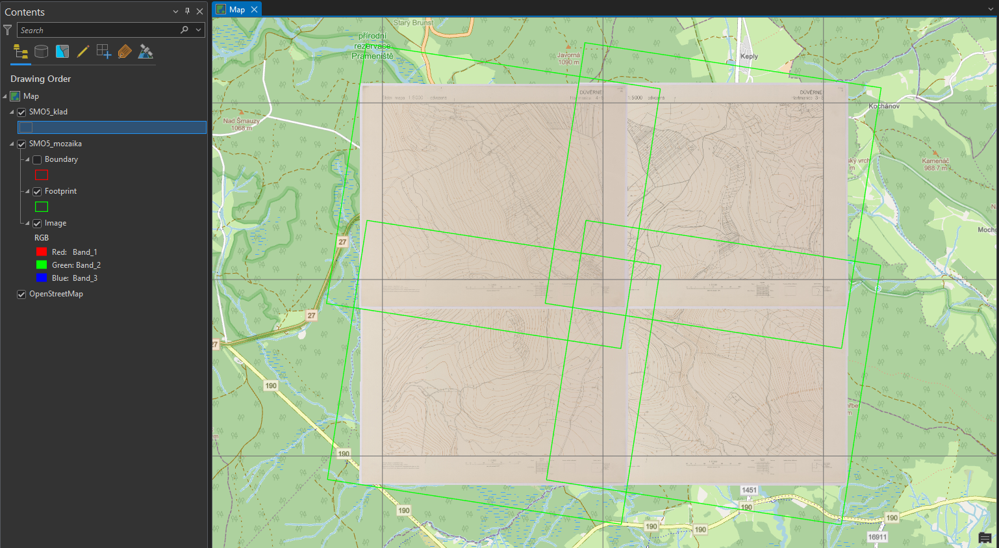
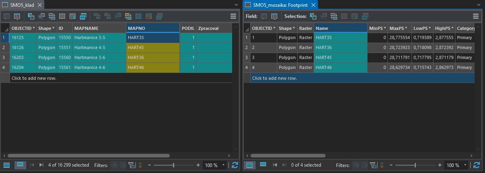
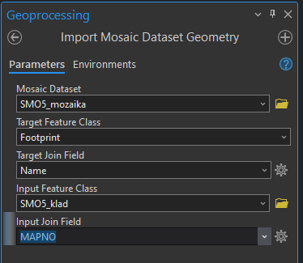
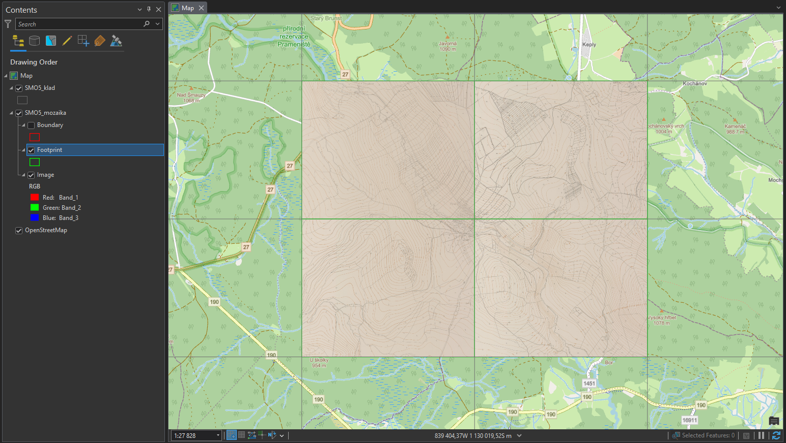
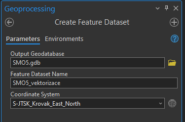
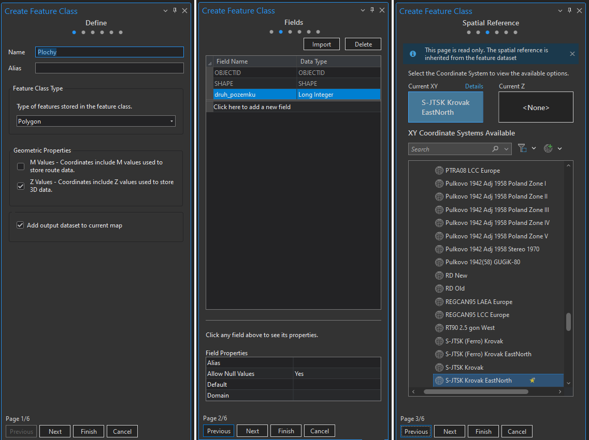
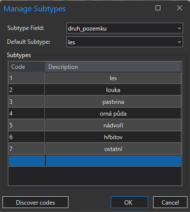
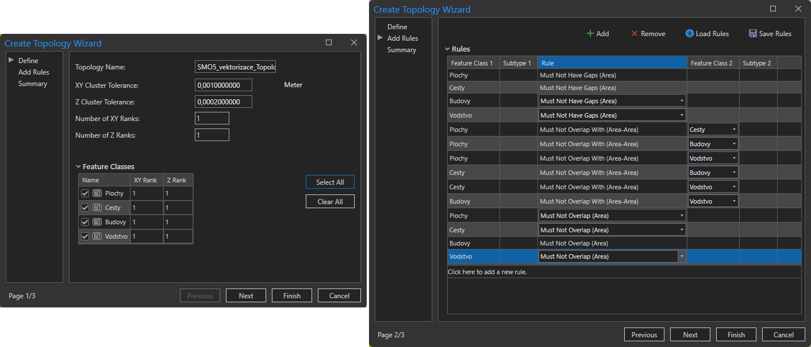

# ArcGIS Online, webové služby, připojení do ArcGIS Pro

## Cíl cvičení

Náplní cvičení je seznámení s prostředním ArcGIS Online. V rámci cvičení si vyzkoušíte publikaci dat z ArcGIS Pro do ArcGIS Online a jejich využití v opačném směru. Ukážeme si také publikaci standardizovaných mapových služeb pomocí ArcGIS Serveru a to, jak je také lze v prostředí ArcGIS Online využít.

## Základní pojmy

- [**ArcGIS Online**](https://doc.arcgis.com/en/arcgis-online/get-started/get-started.htm) – cloudové prostředí pro ukládání, vizualizaci, tvorbu, správu a vytěžování geografických dat

- **webová služba** – rozhraní, skrze které spolu komunikují servery anebo server & klient; speciálně [webová mapová služba](https://mediaspace.esri.com/media/t/1_05edhhbq) je standard pro komunikaci s tzv. *webovým mapovým serverem* poskytujícím geoprostorová data (mapy, vektorová data, dlaždice, nástroje apod.) prostřednictvím internetu

- **publikace dat** – odeslání lokálně uložené mapové kompozice na server (cloud) a vytvoření datové vrstvy přístupné skrze internet

- [**ArcGIS Server**](https://www.esri.com/en-us/arcgis/products/arcgis-enterprise/overview) – součást řešení ArcGIS Enterprise – vlastní mapový server umožňující publikaci webových mapových služeb

- [**Feature Layer**](https://mediaspace.esri.com/media/t/1_ids5c2qs) – typ dat publikovaných do ArcGIS Online – vektorová vrstva nebo skupina vrstev

- [**Tile Layer**](https://www.esri.com/arcgis-blog/products/sharing-collaboration/sharing-collaboration/best-practices-for-using-tile-layers/) – typ dat publikovaných do ArcGIS Online – rastrová vrstva nebo skupina vrstev využívající dlaždicovou cache pro rychlejší načítání obsahu

- [**kredity**](https://www.esri.com/en-us/arcgis/products/credits/overview) – platební jednotka, pomocí které se uskutečňuje úhrada nákladů za vybrané služby ArcGIS Online (úložiště, geoprocessing, data enrichment, využívání cloudových nástrojů jako je on-line geokódování apod.). Každý student má na začátku alokováno 100 kreditů, aby si mohl vyzkoušet používání služeb, které kredity spotřebovávají

## Použité datové podklady

- [Císařské otisky stabilního katastru](../../data/#cisarske-otisky-stabilniho-katastru)
- [Státní mapa 1 : 5 000 – odvozená](../../data/#statni-mapa-1-:-5-500-0-–-odvozena)
- klad SMO5

## Náplň cvičení

### **Vlastní obsah na ArcGIS Online a jeho zveřejnění**

### Vytvořte mapu obcí s rozšířenou působností jednoho z krajů ČR

**1.** Geodatabázi vytvoříme kliknutím pravým tlačítkem myši na složku našeho projektu v záložce *Catalog* -> *New* -> *File Geodatabase*.

???+ note "&nbsp;Poznámka ke geodatabázi:"
      Takto vytvořenou geodatabázi můžeme otevřít v jakémkoliv GIS softwaru (např. ArcGIS PRO, QGIS). Je proto vhodná pro sdílení dat.

<figure markdown>

    <figcaption>Tvorba nové geodatabáze</figcaption>
</figure>

### Vytvořte mapovou službu WMS (OGC standard) nebo Mapping Service (Esri nativní) silnic a železnic ve vašem kraji

**1.** Do mapy si načteme částečně georeferencované listy Státní mapy 1 : 5 000 – odvozené (SMO5). Bude nutné negeoreferencované listy souřadnicově umístit.

**2.** Oproti císařským otiskům stabilního katastru, které se georeferencují na identické body v mapě, lze SMO5 georeferencovat na rohové body mapových listů, které mají dané souřadnice v sysému S–JTSK (EPSG:5514). Pro georeferencování použijeme síť kladu mapových listů SMO5 (síť o rozměrech 2,5x2 km).

**3.** Dle postupu z minulého cvičení si případně georeferencujeme zbývající souřadnicově nepřipojené mapové listy. Následně vytvoříme v nové geodatabázi mozaiku, do které georeferencované rastry importujeme.

### Vyzkoušejte si vytvořit mapovou kompozici kraje s využitím dat z různého umístění

Ve stavu, kdy máme přidané georeferencované rastry do mozaiky, je potřeba oříznout jejich footprint tak, aby se vytvořila bezešvá mapová vrstva. Footprint lze upravit ručně (viz minulé cvičení) nebo automaticky načtením kladu mapových listů.

**1.** V mapovém okně otevřeme mozaiku a klad mapových listů. Kladu změníme symbologii tak, abychom viděli pouze hrany listů. 

<figure markdown>

    <figcaption>Mozaika a klad mapových listů v mapovém okně</figcaption>
</figure>

**2.** Před automatickým ořezem footprintů je nutné zkontrolovat pojmenování listů, které musí být jak v mozaice, tak v kladu listů stejné. Případně je potřebný jiný jednoznačný atribut, na základě kterého se obě vrstvy propojí.

<figure markdown>
{ width="800" }
    <figcaption>Ukázka atributových tabulek předpřipravených vrstev</figcaption>
</figure>

**3.** Automatický ořez footprintu se nastaví pravým kliknutím myši na danou mozaiku -> *Modify* -> *Import Footprints or Boundary*. 

**4.** Ve funkci *Import Mosaic Dataset Geometry* nastavíme parametry dle obrázku níže.

- *Target Feature Class* – vrstva, jejíž geometrii chceme upravit. 

- *Target Join Field* – sloupec s jednoznačným indetifikátorem výstupní vrstvy.

- *Input Feature Class* – ořezová vrstva.

- *Input Join Field* – sloupec s jednoznačným indetifikátorem ořezové vrstvy.

<figure markdown>

    <figcaption>Nastavení funkce Import Mosaic Dataset Geometry</figcaption>
</figure>

**5.** Výsledek funkce *Import Mosaic Dataset Geometry* je vidět níže.

<figure markdown>

    <figcaption>Výsledek automatického ořezu footprintu</figcaption>
</figure>

### Vytvoření nového datasetu v geodatabázi

**1.** Pro vytvoření souhrného datasetu, ve kterém budeme následně uchovávat některé datové vrstvy, je nutné kliknout pravým tlačítkem na cílovou geodatabázi -> *New* -> *Feature Dataset*.

**2.** Otevře se funkce *Create Feature Dataset*, ve které určíme mimo cílové geodatabáze také název a souřadnicový systém datasetu.

<figure markdown>

    <figcaption>Vytvoření datasetu</figcaption>
</figure>

### Vektorizace

Pro analýzu rastrových map, je téměř vždy nutná jejich vektorizace, tedy převedení mapy do vektorové podoby. Existují různé možnosti automatizace tohoto procesu, ale my si ukážeme nejjednodušší metodu, kterou je manuální vektorizace.

#### Založení třídy prvků

**1.** Nejprve je nutné vytvořit si třídy, do kterých budeme vektorizaci zakreslovat. Tento krok se samozřejmě liší dle specifik dané práce, ale pro naši ukázku to znamená, že musíme vytvořit třídy pro typy využití pozemků SMO5, kterou budeme vektorizovat:

- plochy – les, louka, pastvina, orná půda, nádvoří, zahrada, hřbitov apod.
- domy – kostel, domy bez značení
- vodstvo – vodní toky, vodní plochy
- cestní síť

???+ note "&nbsp;Tip před tvorbou třídy prvků:"
      Před tvorbou tříd prvků pro vektorizaci rastrové mapy je vhodné nahlédnout do legendy, abychom měli představu o mapovém obsahu.

<figure markdown>
{ width="600" }
    <figcaption>Legenda SMO5</figcaption>
</figure>

**2.** Pro vytvoření třídy prvků musíme kliknout pravým tlačítkem na příslušný *Feature Dataset* v *Catalogu* -> *New* -> *Feature Class*.

**3.** V této ukázce vytvoříme 4 třídy prvků (plochy, domy, vodstvo a cesty). Ve funkci *Create Feature Class* zvolíme jméno třídy a její typ (pro nás *Polygon*). Následně klikneme na *Next*.

**4.** Na druhé stránce funkce *Create Feature Class* nastavujeme atributová pole třídy. Zde vytvoříme nové pole s názvem *druh_pozemku* po kliknutí na tlačítko *Click here to add a new field*. Datový typ přiřadíme číselný, například *Long Integer*. Tato čísla budou reprezentovat kódy různých druhů pozemku v mapě. Pokračujeme tlačítkem *Next*.

**5.** Na třetí stránce zkontrolujeme souřadnicový systém třídy prvků. Nastavení na dalších stránkách můžeme pomechat ve výchozím stavu.

<figure markdown>
{ width="800" }
    <figcaption>Založení třídy prvků</figcaption>
</figure>

#### Práce se subtypy

Pro kategorizaci dat v atributové tabulce je vhodné používat subtypy. V jednoduchosti se jedná o kódy jednotlivých typů atributů v tabulce, kterým je přiřazen popis pro přehlednější práci. V této ukázce vytvoříme subtypy pro třídu prvků *Plochy*, který nám bude určovat druh využití pozemku.

**1.** Zobrazíme si atributovou tabulku vrstvy *Plochy*. 

**2.** V horní části programu si rozklikneme záložku *Table*

<figure markdown>
{ width="800" }
    <figcaption>Zobrazení polí atributové tabulky</figcaption>
</figure>

**3.** Otevře se nám nová nabídka, ve které zvolíme tlačítko *Subtypes* a následně *Create/Manage*.

<figure markdown>
{ width="800" }
    <figcaption>Zapnutí editace subtypů</figcaption>
</figure>

**4.** V okně *Manage Subtypes* vybereme pole (*Subtype Field*), které chceme editovat a přiřadíme kódy dle druhů využití pozemků, které budeme na zájmovém území vektorizovat. Není problém se kdykoliv do této nabídky vrátit v průběhu práce a případně nový subtyp přidat či smazat.

**5.** Editaci potvrdíme tlačítkem *OK* a následně ji uložíme ikonou *Save* v horní části obrazovky.

<figure markdown>

    <figcaption>Přiřazení kódu subtypům</figcaption>
</figure>

???+ note "&nbsp;Rozlišení subtypů v symbologii:"
      Pro přehlednější práci s daty, je vhodné rozlišit typy ploch barevně. To lze provést přes kliknutí pravým tlačítkem na vrstvu v *Contents* -> *Symbology* -> změnit *Single Symbol* na *Unique Values* -> změnit atribut v nabídce *Field 1* na požadovaný (např. *druh_pozemku*).

#### Kresba

Následuje samotný proces vektorizace, tedy "obkeslení" rastrových dat a vytvoření nových dat ve vektorové formě.

**1.** Nástroje editace vektorových dat se nacházejí v záložce *Edit* v horní části programu. 

**2.** Nové prvky vytvoříme tlačítkem *Create* -> zvolení kresby daného subtypu v okně *Create Features*.

**3.** Vektorizované body přidáváme levým tlačítkem myši. Pro dokončení vektorizace určitého prvku buď dvakrát klikneme levým tlačítkem myši nebo zvolíme ikonu *Finish* v nástrojích v dolní části obrazovky. Při vektorizaci je potřeba myslet na nastavení přichycování bodů ([Snapping](https://pro.arcgis.com/en/pro-app/latest/help/editing/enable-snapping.htm)).

<figure markdown>

    <figcaption>Vektorizace rastrové mapy</figcaption>
</figure>

**Popis nejčastěji používaných funkcí a klávesových zkratek pro editaci vektorových dat:**

<table style="width: 100%;">
  <tbody>
    <tr>
      <td markdown><strong>Right Angle Line</strong></td>
      <td>pravoúhlá linie</td>
    </tr>
    <tr>
      <td><strong>Direction Direction</strong></td>
      <td>průsečík dvou linií</td>
    </tr>
    <tr>
      <td><strong>Arc Segment</strong></td>
      <td>oblouk</td>
    </tr>
        <tr>
      <td><strong>Trace</strong></td>
      <td>přichycení na jiný vektorový prvek v mapě</td>
    </tr>
        <tr>
      <td><strong>stisknutí D</strong></td>
      <td>určení délky linie</td>
    </tr>
        <tr>
      <td><strong>stisknutí A</strong></td>
      <td>určení úhlu linie</td>
    </tr>
        <tr>
      <td><strong>stisknutí P</strong></td>
      <td>rovnoběžná kresba s linií určenou kurzorem myši</td>
    </tr>
        <tr>
      <td><strong>držení T</strong></td>
      <td>zobrazení lomových bodů v okolí kurzoru</td>
    </tr>
        <tr>
      <td><strong>stisknutí F2</strong></td>
      <td>dokončení kresby</td>
    </tr>
        <tr>
      <td><strong>stisknutí F3</strong></td>
      <td>dokončení kresby v pravém úhlu</td>
    </tr>
        <tr>
      <td><strong>stisknutí pravého tlačítka myši</strong></td>
      <td>zobrazení dalších možností kresby</td>
    </tr>
  </tbody>
</table>

???+ note "&nbsp;Uložení editace:"
      Po provedení změn v editaci vektorových dat, je nutné je uložit tlačítkem *Save* v záložce *Edit*.

### Kontrola topologie vektorových dat

Jestliže chceme zkontrolovat topologickou čistotu vektorových dat, musejí být veškerá kontrolovaná data uložena uvnitř jednoho datasetu.

**1.** Pro vytvoření nové topologie klikneme pravým tlačítkem myši na dataset -> *New* -> *Topology*.

**2.** Na první stránce otevřeného okna *Create Topology Wizard* se definují parametry topologie, tedy její název, přesnost a vstupní vrstvy.

**3.** Druhá stránka obsahuje definice jednotlivých kontrolovaných topologických pravidel. Ta se nastaví dle potřeby. V této ukázce proběhne kontrola pravidel *Must Not Have Gaps (Area)* (data nesmí obsahovat mezery), *Must Not Overlap With (Area-Area)* (vrstvy se vzájemně nesmějí překrývat) a *Must Not Overlap (Area)* (jednotlivé vrstvy sami sebe nesmějí překrývat).

**4.** Třetí stránka obsahuje souhrn celé topologie. Tlačítkem *Finish* spustíme kontrolu.

**5.** Pokud se ve výstupním datasetu topologie nezobrazí, aktualizujeme jeho obsah kliknutím pravého tlačítka myši -> *Refresh*.

<figure markdown>

    <figcaption>Nastavení topologie</figcaption>
</figure>

**6.** V následujícím kroku je potřeba kontrolu topologie validovat kliknutím pravým tlačítkem na topologii v *Catalogu* -> *Validate*.

**7.** Po validování přesuneme vrstvu topologie do mapového okna a měly bychom vidět objevené chyby.

**8.** Pomocí nástrojů *Edit* opravíme vyznačené chyby v původních datech. Po editaci topologii znovu validujeme a jestliže kontrola topologie neobjeví žádné chyby, znamená to, že kontrolované vrstvy jsou topologicky korektní.

Na obrázku níže je zobrazena ukázka dvou nalezených topologických chyb (levý horní snímek). Pravý horní snímek zobrazuje pohled na data bez opravy topologie. Při porovnání s pravým dolním snímkem je zřejmé, že vektorizace cesty chybně překryla vektorizaci pastviny. Snímek vlevo dole zobrazuje druhou chybu, tedy vzájemný překryv dvou prvků patřících do vrstvy *Cesty*.

<figure markdown>

    <figcaption>Ukázka topologických chyb</figcaption>
</figure>

???+ note "&nbsp;Tipy po urychlení kontroly topologie:"
      - Pokud je to možné, lze u dat se stejným atributem (např. les, louka) provést [*Dissolve*](https://pro.arcgis.com/en/pro-app/latest/tool-reference/data-management/dissolve.htm), kterým ze sloučených dat odstraníme případné chyby z překryvu stejnou vrstvou (třeba dvě louky vzájemně se překrývající).
      - Pro zjednodušení kontroly topologie je možné všechna kontrolovaná data sloučit do jedné vrstvy, kterou následně zkontrolujeme samotnou. Nemusíme tedy řešit překryvy jednotlivých vrstev mezi sebou (*Must Not Overlap With*), ale zkontrolujeme pouze novou vrstvu samostatně vůči sobě (*Must Not Overlap*). Důležité je však po kontrole nezapomenou opravit případné chyby v původních datech.
      - Odkaz na schématicky popsaná pravidla kontroly topologie je [**ZDE**](https://pro.arcgis.com/en/pro-app/latest/help/editing/pdf/topology_rules_poster.pdf).

## Zadání domácího úkolu k semestrální práci

1. Dle postupu ze cvičení publikujte vybrané plochy SMO5 zadaného katastrálního území do ArcGIS Online. 

2. Proveďte kontrolu zobrazení a symboliky a vrstvu uložte jako položku WebMap do svého uživatelského prostoru.

## Úlohy k procvičení

!!! task-fg-color "Úlohy"

    K řešení následujích úloh použijte datovou sadu [ArcČR
    500](../../data/#arccr-500) verzi 3.3 dostupnou na disku *S* ve složče
    ``K155\Public\data\GIS\ArcCR500 3.3``. Zde také najdete souboru s
    popisem dat ve formátu PDF. 
    
    1. Vytvořte mapu obcí s rozšířenou působností jednoho z krajů ČR.

        Použijte data ORP z datové sady ArcČR
        (ObceSRozsirenouPusobnosti_Polygony), vyexportujte do nové třídy prvků
        pouze zvolený kraj. Mapu doplňte zastavěnými oblastmi obcí nad 5 tisíc
        obyvatel.

        Vyexportujte mapu (Share As ► Service ► My hosted content) a umístěte
        na ArcGIS Online do svého umístění. Jako typ zvolte Feature Service,
        nikoli Tile Layer. Můžete nasdílet se skupinou CTU Prague.

        Jednotlivé plochy ORP popište. Barevnost zvolte tak, aby z mapy byla
        zároveň poznat i příslušnost ORP k okresům (ORP jsou do okresů
        skladebné).

    2. Vytvořte mapovou službu WMS (OGC standard) nebo Mapping Service
       (Esri nativní) silnic a železnic ve vašem kraji.

        Použijte příslušné vrstvy z ArcČR, ořízněte na velikost kraje.

        Vyexportujte mapu (Share As ► Service ► ArcGIS Server) a umístěte na
        server *gis.fsv.cvut.cz* do složky GIS1_2018. Jako typ zvolte mimo
        Mapping také standard *WMS*, případně jiné.

        Připravte si ještě vrstvu vodních ploch (VodniPlochy_Polygony),
        ořízněte ji na plochu kraje a uložte do své složky jako shapefile,
        poslouží později.

    3. Vyzkoušejte si vytvořit mapovou kompozici kraje s využitím dat z různého umístění.

        V mapové kompozici můžete využívat data umístěná v různých formátech:

        - data z ArcGIS Online nebo z vlastního Portal for ArcGIS,
        - data z WMS, WMTS služeb,
        - data ze služeb ArcGIS Serveru,
        - data z WFS služeb,
        - souborová data uložená jako SHP, CSV, GPX aj.,
        - dynamické vrstvy *Živého atlasu Esri*
